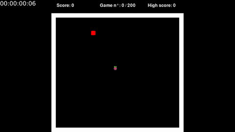

# Reinforcement learning applied to a snake game


[](https://github.com/pre-commit/pre-commit)
[](https://github.com/tterb/atomic-design-ui/blob/master/LICENSEs)

## General description
The purpose of this project is to train an agent using Deep Q-Learning to control a snake.
At any time the snake can choose between the four directions (up/down/left/right).
In order to do so, it applies the Q-function to its current state vector (see below for the state vector description)
The Q-function outputs four values (corresponding to up/down/left/right), giving the expected (long-term) reward for any direction.
For instance if Q(state) = `[10, -5, -10, 0]`, then the upward direction is supposed to be the one giving the best reward
and therefore the snake will go up.
At the beginning the Q-function is randomly initialized and needs to be trained, it takes roughly 100 games for the snake
to behave in a "smart" way, avoiding the walls and moving towards the raspberry.

### Agent state
At any time the snake knows its state. That is: it knows if there's an obstacle just near it (up, down, left, right) and
where the raspberry is (on a row above, below, same line + on a column left, right or the same column)
The state is defined is the method Agent.get_state() 

### Reward
Whenever the snake touches a wall or cuts itself through, the reward is `-20` points. If it manages to eat
a raspberry, it gets a reward of `+10` points

### Training process

The following GIF shows the snake progress throughout the games.
It takes roughly 100 games and 10 minutes for the snake to behave in a "smart" way.



## Getting Started

These instructions will get you a copy of the project up and running on your local machine for development and testing purposes. See deployment for notes on how to deploy the project on a live system.
This project uses Python 3.8.2, however it should work with versions of Python >= 3.6
It also uses Tensorflow 2.2 which requires CUDA 10.1

### Prerequisites

Clone this repository:
```
git clone https://github.com/DTicien/snake-game.git
```

Set up a virtualenv, (we recommend using pyenv + pipenv)
Then install the necessary packages
```
pip install -r requirements.txt
```


You can train the agent using:
```
python game.py
```

## Contributing

Feel free to submit a pull request, however to respect coding style, install `pre-commit` beforehand :

```
pip install pre-commit
pre-commit install
```

## Authors

* **Mathieu SIMON** - *Initial work* - [Github](https://github.com/DTicien)

## License

This project is licensed under the MIT License - see the [LICENSE.md](LICENSE.md) file for details

## Acknowledgments

* Inspiration: [Project: Train a AI how to play Snake](https://github.com/maurock/snake-ga)